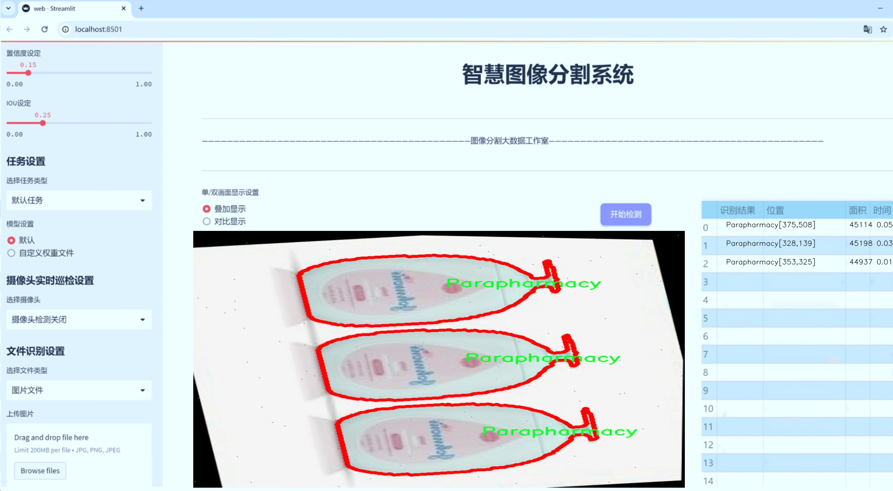
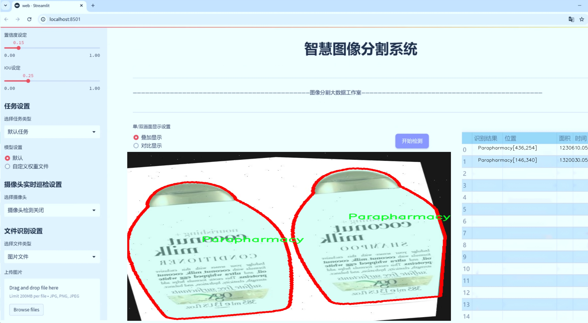
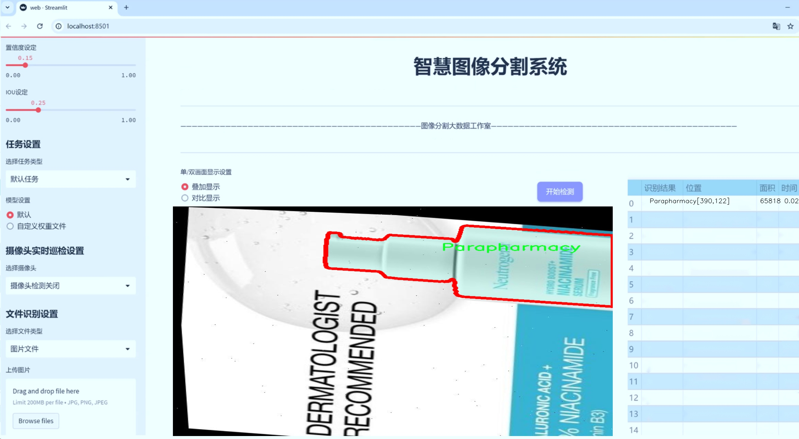
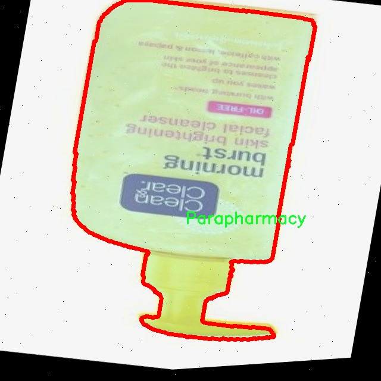
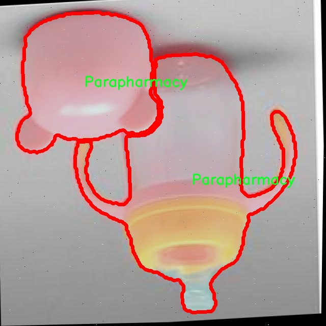
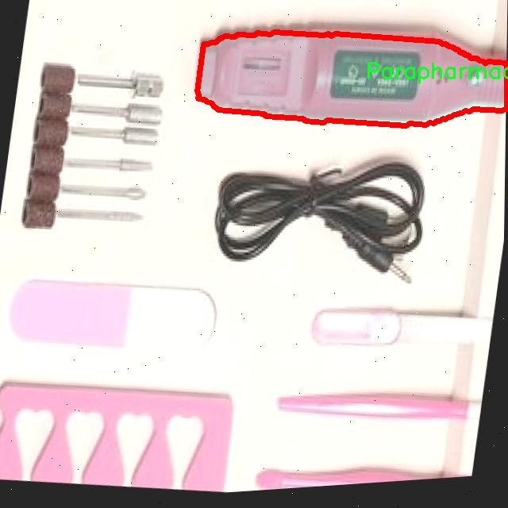
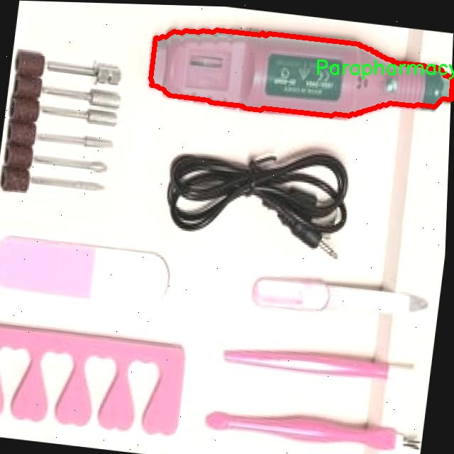
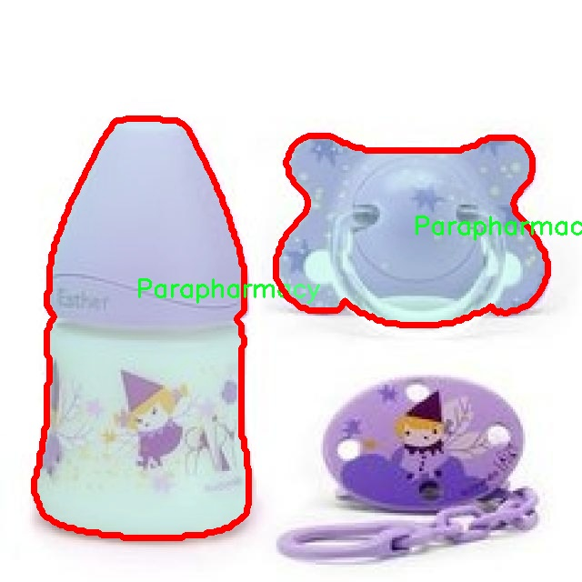

# 药品包装分割系统源码＆数据集分享
 [yolov8-seg-RepHGNetV2＆yolov8-seg-LAWDS等50+全套改进创新点发刊_一键训练教程_Web前端展示]

### 1.研究背景与意义

项目参考[ILSVRC ImageNet Large Scale Visual Recognition Challenge](https://gitee.com/YOLOv8_YOLOv11_Segmentation_Studio/projects)

项目来源[AAAI Global Al lnnovation Contest](https://kdocs.cn/l/cszuIiCKVNis)

研究背景与意义

随着全球制药行业的迅速发展，药品包装的安全性和有效性日益受到重视。药品包装不仅是药品的重要组成部分，更是确保药品质量、保护消费者权益的重要环节。近年来，药品包装的多样性和复杂性不断增加，如何高效、准确地对药品包装进行分割和识别，成为了药品生产和质量控制中的一项重要任务。传统的药品包装检测方法多依赖人工视觉检查，效率低下且容易受到人为因素的影响，难以满足现代化生产的需求。因此，基于计算机视觉和深度学习技术的自动化药品包装分割系统应运而生。

YOLO（You Only Look Once）系列模型因其高效的实时目标检测能力而广泛应用于各类视觉任务中。YOLOv8作为该系列的最新版本，进一步提升了检测精度和速度，适用于复杂背景下的目标识别与分割。针对药品包装的特点，改进YOLOv8模型以实现更为精准的药品包装分割，具有重要的研究价值和应用前景。本研究将基于改进YOLOv8的药品包装分割系统，利用一个包含1200张图像和6个类别（bes、elli、ikiyuz、on、yirmi、yuz）的数据集，探索如何通过深度学习技术提升药品包装的自动化检测能力。

在药品包装的实际应用中，图像的多样性和复杂性对分割模型提出了更高的要求。数据集中包含的不同类别代表了药品包装的多种形式，涵盖了不同的形状、颜色和标签信息。这为模型的训练提供了丰富的样本，有助于提升模型的泛化能力和鲁棒性。通过对数据集的深入分析与处理，改进YOLOv8模型能够更好地适应药品包装的多样性，从而实现更高的分割精度和效率。

此外，药品包装的自动化分割系统不仅可以提高生产效率，降低人工成本，还能有效减少人为错误，确保药品的合规性和安全性。这对于保障公众健康、提升药品质量具有重要的社会意义。通过本研究的实施，期望能够为药品包装的智能化检测提供一种新的解决方案，推动药品生产的自动化和智能化进程。

综上所述，基于改进YOLOv8的药品包装分割系统的研究，不仅在理论上丰富了计算机视觉和深度学习领域的应用研究，也在实践中为药品行业的自动化检测提供了切实可行的技术支持。随着技术的不断进步，未来有望实现更为广泛的应用，为药品包装的安全性和有效性提供保障，推动整个行业的健康发展。

### 2.图片演示







##### 注意：由于此博客编辑较早，上面“2.图片演示”和“3.视频演示”展示的系统图片或者视频可能为老版本，新版本在老版本的基础上升级如下：（实际效果以升级的新版本为准）

  （1）适配了YOLOV8的“目标检测”模型和“实例分割”模型，通过加载相应的权重（.pt）文件即可自适应加载模型。

  （2）支持“图片识别”、“视频识别”、“摄像头实时识别”三种识别模式。

  （3）支持“图片识别”、“视频识别”、“摄像头实时识别”三种识别结果保存导出，解决手动导出（容易卡顿出现爆内存）存在的问题，识别完自动保存结果并导出到tempDir中。

  （4）支持Web前端系统中的标题、背景图等自定义修改，后面提供修改教程。

  另外本项目提供训练的数据集和训练教程,暂不提供权重文件（best.pt）,需要您按照教程进行训练后实现图片演示和Web前端界面演示的效果。

### 3.视频演示

[3.1 视频演示](https://www.bilibili.com/video/BV1mXSeYuEu9/)

### 4.数据集信息展示

##### 4.1 本项目数据集详细数据（类别数＆类别名）

nc: 1
names: ['Parapharmacy']


##### 4.2 本项目数据集信息介绍

数据集信息展示

在本研究中，我们采用了名为“Para”的数据集，以支持改进YOLOv8-seg的药品包装分割系统的训练与验证。该数据集专注于药品包装的图像分割任务，旨在提升药品识别的准确性和效率，进而为药品管理和安全使用提供技术支持。数据集的设计充分考虑了药品包装的多样性和复杂性，确保模型能够在不同场景下进行有效的分割。

“Para”数据集的类别数量为1，具体类别为“Parapharmacy”。这一类别涵盖了各种药品包装的图像，包括药瓶、药盒、药袋等多种形式的包装。这些包装在外观上可能存在显著差异，例如颜色、形状、标签和图案等，因此在数据集的构建过程中，特别注重了样本的多样性与代表性。通过对不同品牌、不同类型的药品包装进行采集和标注，数据集力求涵盖药品包装的广泛特征，以增强模型的泛化能力。

在数据集的构建过程中，采用了高质量的图像采集技术，确保每一张图像都具有清晰的分辨率和真实的场景背景。此外，为了提高模型的训练效果，数据集还进行了数据增强处理，包括旋转、缩放、裁剪和颜色调整等。这些增强技术不仅增加了数据集的样本数量，还有效提升了模型对不同环境和条件下药品包装的适应能力。

在标注方面，数据集采用了精细的分割标注方式，确保每个药品包装的边界都被准确描绘。这种高精度的标注为YOLOv8-seg模型的训练提供了坚实的基础，使其能够学习到药品包装的细微特征和复杂形状。通过这种方式，模型在进行药品包装分割时，不仅能够识别出包装的存在，还能准确地 delineate 出包装的具体轮廓，为后续的图像分析和处理提供可靠的数据支持。

此外，数据集的使用还考虑到了实际应用中的多样化需求。随着药品市场的不断发展，新型药品包装层出不穷，数据集的设计也预留了扩展的可能性。未来，研究者可以根据需要，继续增加新的样本和类别，以适应不断变化的药品包装形态。这种灵活性使得“Para”数据集不仅适用于当前的研究任务，也为未来的研究提供了广阔的空间。

总之，“Para”数据集的构建与应用为改进YOLOv8-seg的药品包装分割系统提供了重要的支持。通过高质量的样本、多样化的标注和灵活的扩展性，该数据集不仅为模型的训练奠定了基础，也为药品包装的智能识别和管理开辟了新的路径。随着研究的深入，期待该数据集能够在药品安全、管理效率等方面发挥更大的作用，为公众健康保驾护航。











### 5.全套项目环境部署视频教程（零基础手把手教学）

[5.1 环境部署教程链接（零基础手把手教学）](https://www.bilibili.com/video/BV1jG4Ve4E9t/?vd_source=bc9aec86d164b67a7004b996143742dc)


[5.2 安装Python虚拟环境创建和依赖库安装视频教程链接（零基础手把手教学）](https://www.bilibili.com/video/BV1nA4VeYEze/?vd_source=bc9aec86d164b67a7004b996143742dc)

### 6.手把手YOLOV8-seg训练视频教程（零基础小白有手就能学会）

[6.1 手把手YOLOV8-seg训练视频教程（零基础小白有手就能学会）](https://www.bilibili.com/video/BV1cA4VeYETe/?vd_source=bc9aec86d164b67a7004b996143742dc)


按照上面的训练视频教程链接加载项目提供的数据集，运行train.py即可开始训练



     Epoch   gpu_mem       box       obj       cls    labels  img_size
     1/200     0G   0.01576   0.01955  0.007536        22      1280: 100%|██████████| 849/849 [14:42<00:00,  1.04s/it]
               Class     Images     Labels          P          R     mAP@.5 mAP@.5:.95: 100%|██████████| 213/213 [01:14<00:00,  2.87it/s]
                 all       3395      17314      0.994      0.957      0.0957      0.0843

     Epoch   gpu_mem       box       obj       cls    labels  img_size
     2/200     0G   0.01578   0.01923  0.007006        22      1280: 100%|██████████| 849/849 [14:44<00:00,  1.04s/it]
               Class     Images     Labels          P          R     mAP@.5 mAP@.5:.95: 100%|██████████| 213/213 [01:12<00:00,  2.95it/s]
                 all       3395      17314      0.996      0.956      0.0957      0.0845

     Epoch   gpu_mem       box       obj       cls    labels  img_size
     3/200     0G   0.01561    0.0191  0.006895        27      1280: 100%|██████████| 849/849 [10:56<00:00,  1.29it/s]
               Class     Images     Labels          P          R     mAP@.5 mAP@.5:.95: 100%|███████   | 187/213 [00:52<00:00,  4.04it/s]
                 all       3395      17314      0.996      0.957      0.0957      0.0845


### 7.50+种全套YOLOV8-seg创新点代码加载调参视频教程（一键加载写好的改进模型的配置文件）

[7.1 50+种全套YOLOV8-seg创新点代码加载调参视频教程（一键加载写好的改进模型的配置文件）](https://www.bilibili.com/video/BV1Hw4VePEXv/?vd_source=bc9aec86d164b67a7004b996143742dc)

### 8.YOLOV8-seg图像分割算法原理

原始YOLOv8-seg算法原理

YOLOv8-seg算法是YOLO系列模型的最新进展，标志着计算机视觉领域在目标检测与实例分割任务上的一次重要飞跃。自2023年1月10日发布以来，YOLOv8凭借其在精度和执行时间上的卓越表现，迅速成为了众多研究者和工程师的首选工具。该模型不仅在目标检测上表现出色，还在实例分割任务中展现了强大的能力，成为计算机视觉领域中的一颗璀璨明珠。

YOLOv8的设计理念继承了YOLOv5、YOLOv6、YOLOX等前辈模型的优点，经过深度优化和改进，形成了一个高效且易于使用的模型架构。与以往的YOLO系列相比，YOLOv8在多个方面进行了创新，尤其是在网络结构和算法效率上，取得了显著的提升。首先，YOLOv8引入了一个全新的骨干网络，采用了3x3的卷积核代替了传统的6x6卷积核，这一变化不仅减少了计算复杂度，还提高了特征提取的精度。

在网络结构方面，YOLOv8采用了CSP（跨阶段局部网络）思想，并结合了PAN-FPN（路径聚合网络）和SPPF（空间金字塔池化）模块，形成了一个更加灵活和高效的特征提取框架。特别是新引入的C2f模块，增加了更多的跳层连接和Split操作，显著增强了网络的梯度信息流动。这种设计使得YOLOv8在处理复杂场景时，能够更好地捕捉到目标的细节信息，从而提升了模型的分割性能。

YOLOv8的检测头部分也经历了重大变革。传统的Anchor-Based检测头被解耦合的Anchor-Free检测头所取代，这一创新使得模型在目标检测时不再依赖于预定义的锚框，从而提高了检测的灵活性和准确性。此外，YOLOv8的损失函数设计也进行了优化，采用了BCELoss作为分类损失，DFLLoss和CIoULoss作为回归损失，这种多元化的损失计算方式使得模型在训练过程中能够更好地平衡分类和回归任务，提高了整体性能。

YOLOv8在数据增强方面的策略也相当独特，采用了动态Task-Aligned Assigner样本分配策略，并在训练的最后10个epoch中关闭了马赛克增强。这一策略的实施，使得模型在训练过程中能够更加专注于关键样本的学习，从而提升了模型的泛化能力。

值得一提的是，YOLOv8的多尺度模型设计，使得其能够根据不同的应用场景提供n、s、m、l、x五种不同尺度的模型选择。这种灵活性不仅使得YOLOv8能够适应各种硬件平台的需求，还能在不同的应用场景中实现最佳的性能表现。例如，在处理小目标检测和高分辨率图像时，YOLOv8展现出了其强大的适应能力和卓越的性能。

在实际应用中，YOLOv8的优势不仅体现在目标检测和实例分割任务上，还扩展到了姿态评估等领域。通过对模型结构的不断优化，YOLOv8在各类视觉任务中均表现出色，为相关领域的研究和应用提供了强有力的支持。特别是在自动化领域，YOLOv8被广泛应用于无人驾驶、智能监控、工业自动化等场景，为这些领域的智能化发展注入了新的活力。

综上所述，YOLOv8-seg算法的原理是一个综合了多种先进技术的高效模型，其创新的网络结构、灵活的检测头设计以及优化的损失函数，使得其在目标检测与实例分割任务中都能够实现卓越的性能。随着YOLOv8的不断发展和应用，预计将会在计算机视觉领域引发更为广泛的关注和研究，为未来的智能视觉系统奠定坚实的基础。


### 9.系统功能展示（检测对象为举例，实际内容以本项目数据集为准）

图9.1.系统支持检测结果表格显示

  图9.2.系统支持置信度和IOU阈值手动调节

  图9.3.系统支持自定义加载权重文件best.pt(需要你通过步骤5中训练获得)

  图9.4.系统支持摄像头实时识别

  图9.5.系统支持图片识别

  图9.6.系统支持视频识别

  图9.7.系统支持识别结果文件自动保存

  图9.8.系统支持Excel导出检测结果数据


### 10.50+种全套YOLOV8-seg创新点原理讲解（非科班也可以轻松写刊发刊，V11版本正在科研待更新）

#### 10.1 由于篇幅限制，每个创新点的具体原理讲解就不一一展开，具体见下列网址中的创新点对应子项目的技术原理博客网址【Blog】：


[10.1 50+种全套YOLOV8-seg创新点原理讲解链接](https://gitee.com/qunmasj/good)

#### 10.2 部分改进模块原理讲解(完整的改进原理见上图和技术博客链接)【如果此小节的图加载失败可以通过CSDN或者Github搜索该博客的标题访问原始博客，原始博客图片显示正常】
### YOLOv8算法原理
YOLOv8算法由Glenn-Jocher 提出，是跟YOLOv3算法、YOLOv5算法一脉相承的，主要的改进点如下:
(1)数据预处理。YOLOv8的数据预处理依旧采用YOLOv5的策略,在训练时，主要采用包括马赛克增强(Mosaic)、混合增强(Mixup)、空间扰动(randomperspective)以及颜色扰动(HSV augment)四个增强手段。
(2)骨干网络结构。YOLOv8的骨干网络结构可从YOLOv5略见一斑，YOLOv5的主干网络的架构规律十分清晰，总体来看就是每用一层步长为2的3×3卷积去降采样特征图，接一个C3模块来进一步强化其中的特征，且C3的基本深度参数分别为“3/6/9/3”，其会根据不同规模的模型的来做相应的缩放。在的YOLOv8中，大体上也还是继承了这一特点，原先的C3模块均被替换成了新的C2f模块，C2f 模块加入更多的分支，丰富梯度回传时的支流。下面展示了YOLOv8的C2f模块和YOLOv5的C3模块，其网络结构图所示。


(3)FPN-PAN结构。YOLOv8仍采用FPN+PAN结构来构建YOLO的特征金字塔，使多尺度信息之间进行充分的融合。除了FPN-PAN里面的C3模块被替换为C2f模块外，其余部分与YOLOv5的FPN-PAN结构基本一致。
(4)Detection head结构。从 YOLOv3到 YOLOv5，其检测头一直都是“耦合”(Coupled)的,即使用一层卷积同时完成分类和定位两个任务，直到YOLOX的问世， YOLO系列才第一次换装“解耦头”(Decoupled Head)。YOLOv8也同样也采用了解耦头的结构，两条并行的分支分别取提取类别特征和位置特征，然后各用一层1x1卷积完成分类和定位任务。YOLOv8整体的网络结构由图所示。


(5)标签分配策略。尽管YOLOv5设计了自动聚类候选框的一些功能，但是聚类候选框是依赖于数据集的。若数据集不够充分，无法较为准确地反映数据本身的分布特征，聚类出来的候选框也会与真实物体尺寸比例悬殊过大。YOLOv8没有采用候选框策略，所以解决的问题就是正负样本匹配的多尺度分配。不同于YOLOX所使用的 SimOTA，YOLOv8在标签分配问题上采用了和YOLOv6相同的TOOD策略，是一种动态标签分配策略。YOLOv8只用到了targetboze。和target scores，未含是否有物体预测，故 YOLOv8的损失就主要包括两大部分∶类别损失和位置损失。对于YOLOv8，其分类损失为VFLLoss(Varifocal Loss)，其回归损失为CIoU Loss 与 DFL Loss 的形式。
其中 Varifocal Loss定义如下:


其中p为预测的类别得分，p ∈ [0.1]。q为预测的目标分数(若为真实类别，则q为预测和真值的 loU;若为其他类别。q为0 )。VFL Loss使用不对称参数来对正负样本进行加权，通过只对负样本进行衰减，达到不对等的处理前景和背景对损失的贡献。对正样本，使用q进行了加权，如果正样本的GTiou很高时,则对损失的贡献更大一些，可以让网络聚焦于那些高质量的样本上，即训练高质量的正例对AP的提升比低质量的更大一些。对负样本，使用p进行了降权，降低了负例对损失的贡献，因负样本的预测p在取次幂后会变得更小，这样就能够降低负样本对损失的整体贡献。

### 动态蛇形卷积Dynamic Snake Convolution

参考论文： 2307.08388.pdf (arxiv.org)

血管、道路等拓扑管状结构的精确分割在各个领域都至关重要，确保下游任务的准确性和效率。 然而，许多因素使任务变得复杂，包括薄的局部结构和可变的全局形态。在这项工作中，我们注意到管状结构的特殊性，并利用这些知识来指导我们的 DSCNet 在三个阶段同时增强感知：特征提取、特征融合、 和损失约束。 首先，我们提出了一种动态蛇卷积，通过自适应地关注细长和曲折的局部结构来准确捕获管状结构的特征。 随后，我们提出了一种多视图特征融合策略，以补充特征融合过程中多角度对特征的关注，确保保留来自不同全局形态的重要信息。 最后，提出了一种基于持久同源性的连续性约束损失函数，以更好地约束分割的拓扑连续性。 2D 和 3D 数据集上的实验表明，与多种方法相比，我们的 DSCNet 在管状结构分割任务上提供了更好的准确性和连续性。 我们的代码是公开的。 
主要的挑战源于细长微弱的局部结构特征与复杂多变的全局形态特征。本文关注到管状结构细长连续的特点，并利用这一信息在神经网络以下三个阶段同时增强感知：特征提取、特征融合和损失约束。分别设计了动态蛇形卷积（Dynamic Snake Convolution），多视角特征融合策略与连续性拓扑约束损失。 

我们希望卷积核一方面能够自由地贴合结构学习特征，另一方面能够在约束条件下不偏离目标结构太远。在观察管状结构的细长连续的特征后，脑海里想到了一个动物——蛇。我们希望卷积核能够像蛇一样动态地扭动，来贴合目标的结构。

我们希望卷积核一方面能够自由地贴合结构学习特征，另一方面能够在约束条件下不偏离目标结构太远。在观察管状结构的细长连续的特征后，脑海里想到了一个动物——蛇。我们希望卷积核能够像蛇一样动态地扭动，来贴合目标的结构。


### DCNV2融入YOLOv8
DCN和DCNv2（可变性卷积）
网上关于两篇文章的详细描述已经很多了，我这里具体的细节就不多讲了，只说一下其中实现起来比较困惑的点。（黑体字会讲解）

DCNv1解决的问题就是我们常规的图像增强，仿射变换（线性变换加平移）不能解决的多种形式目标变换的几何变换的问题。如下图所示。

可变性卷积的思想很简单，就是讲原来固定形状的卷积核变成可变的。如下图所示：


首先来看普通卷积，以3x3卷积为例对于每个输出y(p0)，都要从x上采样9个位置，这9个位置都在中心位置x(p0)向四周扩散得到的gird形状上，(-1,-1)代表x(p0)的左上角，(1,1)代表x(p0)的右下角，其他类似。

用公式表示如下：


可变性卷积Deformable Conv操作并没有改变卷积的计算操作，而是在卷积操作的作用区域上，加入了一个可学习的参数∆pn。同样对于每个输出y(p0)，都要从x上采样9个位置，这9个位置是中心位置x(p0)向四周扩散得到的，但是多了 ∆pn，允许采样点扩散成非gird形状。


偏移量是通过对原始特征层进行卷积得到的。比如输入特征层是w×h×c，先对输入的特征层进行卷积操作，得到w×h×2c的offset field。这里的w和h和原始特征层的w和h是一致的，offset field里面的值是输入特征层对应位置的偏移量，偏移量有x和y两个方向，所以offset field的channel数是2c。offset field里的偏移量是卷积得到的，可能是浮点数，所以接下来需要通过双向性插值计算偏移位置的特征值。在偏移量的学习中，梯度是通过双线性插值来进行反向传播的。
看到这里是不是还是有点迷茫呢？那到底程序上面怎么实现呢？


事实上由上面的公式我们可以看得出来∆pn这个偏移量是加在原像素点上的，但是我们怎么样从代码上对原像素点加这个量呢？其实很简单，就是用一个普通的卷积核去跟输入图片（一般是输入的feature_map）卷积就可以了卷积核的数量是2N也就是23*3==18（前9个通道是x方向的偏移量，后9个是y方向的偏移量），然后把这个卷积的结果与正常卷积的结果进行相加就可以了。
然后又有了第二个问题，怎么样反向传播呢？为什么会有这个问题呢？因为求出来的偏移量+正常卷积输出的结果往往是一个浮点数，浮点数是无法对应到原图的像素点的，所以自然就想到了双线性差值的方法求出浮点数对应的浮点像素点。


#### DCN v2
对于positive的样本来说，采样的特征应该focus在RoI内，如果特征中包含了过多超出RoI的内容，那么结果会受到影响和干扰。而negative样本则恰恰相反，引入一些超出RoI的特征有助于帮助网络判别这个区域是背景区域。

DCNv1引入了可变形卷积，能更好的适应目标的几何变换。但是v1可视化结果显示其感受野对应位置超出了目标范围，导致特征不受图像内容影响（理想情况是所有的对应位置分布在目标范围以内）。

为了解决该问题：提出v2, 主要有

1、扩展可变形卷积，增强建模能力
2、提出了特征模拟方案指导网络培训：feature mimicking scheme

上面这段话是什么意思呢，通俗来讲就是，我们的可变性卷积的区域大于目标所在区域，所以这时候就会对非目标区域进行错误识别。

所以自然能想到的解决方案就是加入权重项进行惩罚。（至于这个实现起来就比较简单了，直接初始化一个权重然后乘(input+offsets)就可以了）


可调节的RoIpooling也是类似的，公式如下：


### 11.项目核心源码讲解（再也不用担心看不懂代码逻辑）

#### 11.1 ultralytics\models\yolo\pose\val.py

以下是对代码的核心部分进行提炼和详细注释的结果：

```python
# 导入必要的库
from pathlib import Path
import numpy as np
import torch
from ultralytics.models.yolo.detect import DetectionValidator
from ultralytics.utils import LOGGER, ops
from ultralytics.utils.metrics import PoseMetrics, box_iou, kpt_iou

class PoseValidator(DetectionValidator):
    """
    PoseValidator类，继承自DetectionValidator，用于基于姿态模型的验证。
    """

    def __init__(self, dataloader=None, save_dir=None, pbar=None, args=None, _callbacks=None):
        """初始化PoseValidator对象，设置参数和属性。"""
        super().__init__(dataloader, save_dir, pbar, args, _callbacks)
        self.sigma = None  # 用于计算关键点的sigma值
        self.kpt_shape = None  # 关键点的形状
        self.args.task = 'pose'  # 设置任务类型为姿态
        self.metrics = PoseMetrics(save_dir=self.save_dir, on_plot=self.on_plot)  # 初始化姿态度量
        # 针对Apple MPS设备的警告
        if isinstance(self.args.device, str) and self.args.device.lower() == 'mps':
            LOGGER.warning("WARNING ⚠️ Apple MPS known Pose bug. Recommend 'device=cpu' for Pose models.")

    def preprocess(self, batch):
        """对批次数据进行预处理，将关键点数据转换为浮点数并移动到指定设备。"""
        batch = super().preprocess(batch)  # 调用父类的预处理方法
        batch['keypoints'] = batch['keypoints'].to(self.device).float()  # 转换关键点为浮点数并移动到设备
        return batch

    def postprocess(self, preds):
        """应用非极大值抑制，返回高置信度的检测结果。"""
        return ops.non_max_suppression(preds,
                                       self.args.conf,
                                       self.args.iou,
                                       labels=self.lb,
                                       multi_label=True,
                                       agnostic=self.args.single_cls,
                                       max_det=self.args.max_det,
                                       nc=self.nc)

    def init_metrics(self, model):
        """初始化YOLO模型的姿态估计度量。"""
        super().init_metrics(model)  # 调用父类的初始化方法
        self.kpt_shape = self.data['kpt_shape']  # 获取关键点形状
        is_pose = self.kpt_shape == [17, 3]  # 判断是否为姿态任务
        nkpt = self.kpt_shape[0]  # 关键点数量
        self.sigma = OKS_SIGMA if is_pose else np.ones(nkpt) / nkpt  # 设置sigma值

    def update_metrics(self, preds, batch):
        """更新度量，计算正确的关键点和边界框。"""
        for si, pred in enumerate(preds):  # 遍历每个预测
            idx = batch['batch_idx'] == si  # 获取当前批次的索引
            cls = batch['cls'][idx]  # 获取当前批次的类别
            bbox = batch['bboxes'][idx]  # 获取当前批次的边界框
            kpts = batch['keypoints'][idx]  # 获取当前批次的关键点
            npr = pred.shape[0]  # 预测数量
            shape = batch['ori_shape'][si]  # 原始图像形状
            correct_kpts = torch.zeros(npr, self.niou, dtype=torch.bool, device=self.device)  # 初始化正确关键点
            correct_bboxes = torch.zeros(npr, self.niou, dtype=torch.bool, device=self.device)  # 初始化正确边界框
            self.seen += 1  # 记录已处理的批次数

            if npr == 0:  # 如果没有预测
                if cls.shape[0]:  # 如果有类别
                    self.stats.append((correct_bboxes, correct_kpts, *torch.zeros((2, 0), device=self.device), cls.squeeze(-1)))
                continue  # 跳过当前循环

            # 处理预测
            predn = pred.clone()  # 克隆预测
            ops.scale_boxes(batch['img'][si].shape[1:], predn[:, :4], shape, ratio_pad=batch['ratio_pad'][si])  # 缩放边界框
            pred_kpts = predn[:, 6:].view(npr, -1, 3)  # 处理关键点

            # 评估
            if cls.shape[0]:  # 如果有类别
                height, width = batch['img'].shape[2:]  # 获取图像高度和宽度
                tbox = ops.xywh2xyxy(bbox) * torch.tensor((width, height, width, height), device=self.device)  # 目标边界框
                ops.scale_boxes(batch['img'][si].shape[1:], tbox, shape, ratio_pad=batch['ratio_pad'][si])  # 缩放目标边界框
                tkpts = kpts.clone()  # 克隆关键点
                tkpts[..., 0] *= width  # 缩放x坐标
                tkpts[..., 1] *= height  # 缩放y坐标
                tkpts = ops.scale_coords(batch['img'][si].shape[1:], tkpts, shape, ratio_pad=batch['ratio_pad'][si])  # 缩放关键点
                labelsn = torch.cat((cls, tbox), 1)  # 合并类别和边界框
                correct_bboxes = self._process_batch(predn[:, :6], labelsn)  # 处理边界框
                correct_kpts = self._process_batch(predn[:, :6], labelsn, pred_kpts, tkpts)  # 处理关键点

            # 记录统计信息
            self.stats.append((correct_bboxes, correct_kpts, pred[:, 4], pred[:, 5], cls.squeeze(-1)))

    def _process_batch(self, detections, labels, pred_kpts=None, gt_kpts=None):
        """
        返回正确的预测矩阵。

        参数:
            detections (torch.Tensor): 形状为[N, 6]的检测张量，格式为: x1, y1, x2, y2, conf, class。
            labels (torch.Tensor): 形状为[M, 5]的标签张量，格式为: class, x1, y1, x2, y2。
            pred_kpts (torch.Tensor, 可选): 形状为[N, 51]的预测关键点张量。
            gt_kpts (torch.Tensor, 可选): 形状为[N, 51]的真实关键点张量。

        返回:
            torch.Tensor: 形状为[N, 10]的正确预测矩阵。
        """
        if pred_kpts is not None and gt_kpts is not None:
            area = ops.xyxy2xywh(labels[:, 1:])[:, 2:].prod(1) * 0.53  # 计算区域
            iou = kpt_iou(gt_kpts, pred_kpts, sigma=self.sigma, area=area)  # 计算关键点IoU
        else:  # 处理边界框
            iou = box_iou(labels[:, 1:], detections[:, :4])  # 计算边界框IoU

        return self.match_predictions(detections[:, 5], labels[:, 0], iou)  # 匹配预测

    def plot_val_samples(self, batch, ni):
        """绘制并保存验证集样本及其预测的边界框和关键点。"""
        plot_images(batch['img'],
                    batch['batch_idx'],
                    batch['cls'].squeeze(-1),
                    batch['bboxes'],
                    kpts=batch['keypoints'],
                    paths=batch['im_file'],
                    fname=self.save_dir / f'val_batch{ni}_labels.jpg',
                    names=self.names,
                    on_plot=self.on_plot)

    def pred_to_json(self, predn, filename):
        """将YOLO预测转换为COCO JSON格式。"""
        stem = Path(filename).stem
        image_id = int(stem) if stem.isnumeric() else stem  # 获取图像ID
        box = ops.xyxy2xywh(predn[:, :4])  # 转换为xywh格式
        box[:, :2] -= box[:, 2:] / 2  # 将中心坐标转换为左上角坐标
        for p, b in zip(predn.tolist(), box.tolist()):
            self.jdict.append({
                'image_id': image_id,
                'category_id': self.class_map[int(p[5])],
                'bbox': [round(x, 3) for x in b],
                'keypoints': p[6:],
                'score': round(p[4], 5)})

    def eval_json(self, stats):
        """使用COCO JSON格式评估目标检测模型。"""
        if self.args.save_json and self.is_coco and len(self.jdict):
            anno_json = self.data['path'] / 'annotations/person_keypoints_val2017.json'  # 注释文件
            pred_json = self.save_dir / 'predictions.json'  # 预测文件
            LOGGER.info(f'\nEvaluating pycocotools mAP using {pred_json} and {anno_json}...')
            try:
                check_requirements('pycocotools>=2.0.6')  # 检查依赖
                from pycocotools.coco import COCO  # 导入COCO API
                from pycocotools.cocoeval import COCOeval  # 导入COCO评估API

                for x in anno_json, pred_json:
                    assert x.is_file(), f'{x} file not found'  # 确保文件存在
                anno = COCO(str(anno_json))  # 初始化注释API
                pred = anno.loadRes(str(pred_json))  # 初始化预测API
                for i, eval in enumerate([COCOeval(anno, pred, 'bbox'), COCOeval(anno, pred, 'keypoints')]):
                    if self.is_coco:
                        eval.params.imgIds = [int(Path(x).stem) for x in self.dataloader.dataset.im_files]  # 设置评估图像
                    eval.evaluate()  # 评估
                    eval.accumulate()  # 累积结果
                    eval.summarize()  # 总结结果
                    idx = i * 4 + 2
                    stats[self.metrics.keys[idx + 1]], stats[self.metrics.keys[idx]] = eval.stats[:2]  # 更新mAP
            except Exception as e:
                LOGGER.warning(f'pycocotools unable to run: {e}')  # 捕获异常并记录警告
        return stats  # 返回统计信息
```

### 代码核心部分说明：
1. **PoseValidator类**：继承自DetectionValidator，专门用于姿态检测的验证。
2. **初始化方法**：设置一些基本参数，初始化姿态度量，并处理设备兼容性。
3. **预处理方法**：将输入批次中的关键点数据转换为浮点数并移动到指定设备。
4. **后处理方法**：应用非极大值抑制以过滤低置信度的检测结果。
5. **度量初始化和更新**：设置和更新用于评估模型性能的指标。
6. **绘图和结果保存**：提供绘制验证样本和将预测结果保存为JSON格式的功能。
7. **评估方法**：使用COCO格式评估模型的性能，计算mAP等指标。

这些核心部分构成了PoseValidator类的主要功能，能够实现姿态检测模型的验证和评估。

这个文件 `val.py` 是 Ultralytics YOLO 项目中的一个模块，专门用于姿态估计模型的验证。它继承自 `DetectionValidator` 类，主要负责处理姿态估计的验证过程，包括数据预处理、模型评估、指标计算和结果可视化等功能。

在类的初始化方法中，首先调用父类的构造函数，并设置一些特定于姿态估计的参数，比如 `sigma` 和 `kpt_shape`。如果使用的是 Apple 的 MPS 设备，程序会发出警告，建议使用 CPU 进行模型推理。接着，初始化姿态估计的指标对象 `PoseMetrics`，用于后续的性能评估。

`preprocess` 方法负责对输入的批次数据进行预处理，将关键点数据转换为浮点数并移动到指定的设备上。`get_desc` 方法返回一个字符串，描述了评估指标的格式，包括类别、图像数量、实例数量、框的精度等。

在 `postprocess` 方法中，应用非极大值抑制（NMS）来过滤掉低置信度的检测结果，确保只保留高置信度的检测框。`init_metrics` 方法用于初始化姿态估计的指标，判断关键点的形状是否符合预期，并设置相应的 `sigma` 值。

`update_metrics` 方法是关键的评估步骤，负责计算模型的预测结果与真实标签之间的匹配情况。它会处理每个批次的预测，计算正确的关键点和边界框，并更新统计信息。这里使用了 `scale_boxes` 和 `scale_coords` 方法来将预测结果和真实标签转换到相同的坐标空间，以便进行比较。

`_process_batch` 方法用于处理检测结果和标签，计算它们之间的交并比（IoU），并返回正确的预测矩阵。`plot_val_samples` 和 `plot_predictions` 方法则用于可视化验证样本和模型的预测结果，将它们保存为图像文件。

`pred_to_json` 方法将模型的预测结果转换为 COCO 格式的 JSON 文件，以便于后续的评估和分析。`eval_json` 方法则负责使用 COCO API 评估模型的性能，计算平均精度（mAP）等指标，并将结果记录到统计信息中。

总体而言，这个文件实现了姿态估计模型验证的完整流程，从数据预处理到结果评估，涵盖了多个重要的步骤和功能。

#### 11.2 ultralytics\utils\autobatch.py

以下是经过简化并添加详细中文注释的核心代码部分：

```python
import numpy as np
import torch
from ultralytics.utils import LOGGER, colorstr
from ultralytics.utils.torch_utils import profile

def check_train_batch_size(model, imgsz=640, amp=True):
    """
    检查YOLO模型的训练批量大小。
    
    参数:
        model (torch.nn.Module): 要检查批量大小的YOLO模型。
        imgsz (int): 用于训练的图像大小。
        amp (bool): 如果为True，则使用自动混合精度（AMP）进行训练。
    
    返回:
        (int): 使用autobatch()函数计算的最佳批量大小。
    """
    with torch.cuda.amp.autocast(amp):
        return autobatch(model.train(), imgsz)  # 计算最佳批量大小

def autobatch(model, imgsz=640, fraction=0.60, batch_size=16):
    """
    自动估计最佳YOLO批量大小，以使用可用CUDA内存的一部分。
    
    参数:
        model (torch.nn.Module): 要计算批量大小的YOLO模型。
        imgsz (int): 用作YOLO模型输入的图像大小，默认为640。
        fraction (float): 要使用的可用CUDA内存的比例，默认为0.60。
        batch_size (int): 如果检测到错误，则使用的默认批量大小，默认为16。
    
    返回:
        (int): 最佳批量大小。
    """
    
    # 检查设备
    prefix = colorstr('AutoBatch: ')
    LOGGER.info(f'{prefix}计算图像大小为{imgsz}的最佳批量大小')
    device = next(model.parameters()).device  # 获取模型设备
    if device.type == 'cpu':
        LOGGER.info(f'{prefix}未检测到CUDA，使用默认CPU批量大小 {batch_size}')
        return batch_size

    # 检查CUDA内存
    gb = 1 << 30  # 字节转换为GiB (1024 ** 3)
    properties = torch.cuda.get_device_properties(device)  # 获取设备属性
    total_memory = properties.total_memory / gb  # 总内存（GiB）
    reserved_memory = torch.cuda.memory_reserved(device) / gb  # 保留内存（GiB）
    allocated_memory = torch.cuda.memory_allocated(device) / gb  # 已分配内存（GiB）
    free_memory = total_memory - (reserved_memory + allocated_memory)  # 可用内存（GiB）
    
    LOGGER.info(f'{prefix}{device} ({properties.name}) {total_memory:.2f}G 总, {reserved_memory:.2f}G 保留, {allocated_memory:.2f}G 已分配, {free_memory:.2f}G 可用')

    # 配置批量大小
    batch_sizes = [1, 2, 4, 8, 16]
    try:
        img = [torch.empty(b, 3, imgsz, imgsz) for b in batch_sizes]  # 创建空图像张量
        results = profile(img, model, n=3, device=device)  # 评估内存使用情况

        # 拟合解决方案
        memory_usage = [x[2] for x in results if x]  # 提取内存使用情况
        p = np.polyfit(batch_sizes[:len(memory_usage)], memory_usage, deg=1)  # 一次多项式拟合
        optimal_batch_size = int((free_memory * fraction - p[1]) / p[0])  # 计算最佳批量大小
        
        # 检查失败情况
        if None in results:
            fail_index = results.index(None)  # 找到第一个失败的索引
            if optimal_batch_size >= batch_sizes[fail_index]:  # 如果最佳批量大小超过失败点
                optimal_batch_size = batch_sizes[max(fail_index - 1, 0)]  # 选择前一个安全点
        
        # 检查最佳批量大小是否在安全范围内
        if optimal_batch_size < 1 or optimal_batch_size > 1024:
            optimal_batch_size = batch_size
            LOGGER.info(f'{prefix}警告 ⚠️ 检测到CUDA异常，使用默认批量大小 {batch_size}.')

        # 记录实际使用的内存比例
        fraction_used = (np.polyval(p, optimal_batch_size) + reserved_memory + allocated_memory) / total_memory
        LOGGER.info(f'{prefix}使用批量大小 {optimal_batch_size}，内存使用 {total_memory * fraction_used:.2f}G/{total_memory:.2f}G ({fraction_used * 100:.0f}%) ✅')
        return optimal_batch_size
    except Exception as e:
        LOGGER.warning(f'{prefix}警告 ⚠️ 检测到错误: {e}, 使用默认批量大小 {batch_size}.')
        return batch_size
```

### 代码注释说明：
1. **check_train_batch_size** 函数用于检查给定YOLO模型的最佳训练批量大小，支持自动混合精度（AMP）。
2. **autobatch** 函数自动估计最佳批量大小，确保使用的CUDA内存不超过可用内存的一部分。
3. 代码中使用了CUDA设备的内存信息来动态计算可用的批量大小，并通过多项式拟合的方法来预测最佳批量大小。
4. 在内存不足或出现错误时，代码会回退到默认的批量大小，并记录相关警告信息。

这个程序文件的主要功能是自动估算适合YOLO模型的最佳批处理大小，以便在PyTorch中使用可用CUDA内存的一部分。文件中包含了一些函数和逻辑，帮助用户在训练YOLO模型时优化内存使用。

首先，文件导入了一些必要的库，包括`deepcopy`、`numpy`和`torch`，以及一些来自`ultralytics.utils`的工具和配置。接着，定义了两个主要的函数：`check_train_batch_size`和`autobatch`。

`check_train_batch_size`函数的作用是检查给定YOLO模型的训练批处理大小。它接受三个参数：模型、图像大小和一个布尔值表示是否使用自动混合精度（AMP）。在函数内部，使用`torch.cuda.amp.autocast`来自动处理混合精度，然后调用`autobatch`函数来计算最佳批处理大小。

`autobatch`函数是核心功能，负责自动估算最佳批处理大小。它接受四个参数：模型、图像大小、使用的CUDA内存比例和默认批处理大小。函数首先检查模型所在的设备，如果是CPU，则返回默认的批处理大小。如果CUDA可用但`torch.backends.cudnn.benchmark`为真，则也返回默认的批处理大小。

接下来，函数会检查CUDA内存的使用情况，包括总内存、已保留内存、已分配内存和可用内存，并将这些信息记录到日志中。然后，函数会尝试对不同的批处理大小（1、2、4、8、16）进行性能分析，生成相应的输入图像，并使用`profile`函数来获取内存使用情况。

通过对内存使用情况进行线性拟合，函数计算出最佳批处理大小。如果在分析过程中某些批处理大小失败，函数会选择一个安全的批处理大小。如果计算出的批处理大小不在安全范围内（小于1或大于1024），则会使用默认的批处理大小，并记录警告信息。

最后，函数会记录所使用的批处理大小和实际的内存使用比例，并返回最佳批处理大小。如果在执行过程中发生异常，函数会捕获异常并返回默认的批处理大小，同时记录警告信息。

总体而言，这个文件提供了一种智能的方式来优化YOLO模型的训练过程，确保在使用CUDA时不会超出可用内存的限制。

#### 11.3 ultralytics\utils\callbacks\mlflow.py

以下是经过简化和注释的核心代码部分：

```python
# 导入必要的库和模块
from ultralytics.utils import LOGGER, RUNS_DIR, SETTINGS, TESTS_RUNNING, colorstr

try:
    import os
    import mlflow  # 导入MLflow库

    # 确保在非测试环境下运行且已启用MLflow集成
    assert not TESTS_RUNNING or 'test_mlflow' in os.environ.get('PYTEST_CURRENT_TEST', '')
    assert SETTINGS['mlflow'] is True
    assert hasattr(mlflow, '__version__')  # 确保mlflow库已正确导入

    from pathlib import Path
    PREFIX = colorstr('MLflow: ')  # 设置日志前缀

except (ImportError, AssertionError):
    mlflow = None  # 如果导入失败，mlflow设为None


def on_pretrain_routine_end(trainer):
    """
    在预训练结束时记录训练参数到MLflow。

    参数:
        trainer (ultralytics.engine.trainer.BaseTrainer): 包含要记录的参数的训练对象。

    全局变量:
        mlflow: 用于记录的mlflow模块。

    环境变量:
        MLFLOW_TRACKING_URI: MLflow跟踪的URI，默认为'runs/mlflow'。
        MLFLOW_EXPERIMENT_NAME: MLflow实验的名称，默认为trainer.args.project。
        MLFLOW_RUN: MLflow运行的名称，默认为trainer.args.name。
    """
    global mlflow

    # 获取跟踪URI，默认值为'runs/mlflow'
    uri = os.environ.get('MLFLOW_TRACKING_URI') or str(RUNS_DIR / 'mlflow')
    LOGGER.debug(f'{PREFIX} tracking uri: {uri}')
    mlflow.set_tracking_uri(uri)  # 设置MLflow跟踪URI

    # 设置实验和运行名称
    experiment_name = os.environ.get('MLFLOW_EXPERIMENT_NAME') or trainer.args.project or '/Shared/YOLOv8'
    run_name = os.environ.get('MLFLOW_RUN') or trainer.args.name
    mlflow.set_experiment(experiment_name)  # 设置实验名称

    mlflow.autolog()  # 启用自动记录
    try:
        # 开始MLflow运行
        active_run = mlflow.active_run() or mlflow.start_run(run_name=run_name)
        LOGGER.info(f'{PREFIX}logging run_id({active_run.info.run_id}) to {uri}')
        if Path(uri).is_dir():
            LOGGER.info(f"{PREFIX}view at http://127.0.0.1:5000 with 'mlflow server --backend-store-uri {uri}'")
        LOGGER.info(f"{PREFIX}disable with 'yolo settings mlflow=False'")
        mlflow.log_params(dict(trainer.args))  # 记录训练参数
    except Exception as e:
        LOGGER.warning(f'{PREFIX}WARNING ⚠️ Failed to initialize: {e}\n'
                       f'{PREFIX}WARNING ⚠️ Not tracking this run')


def on_fit_epoch_end(trainer):
    """在每个训练周期结束时记录训练指标到MLflow。"""
    if mlflow:
        # 清理指标名称并记录到MLflow
        sanitized_metrics = {k.replace('(', '').replace(')', ''): float(v) for k, v in trainer.metrics.items()}
        mlflow.log_metrics(metrics=sanitized_metrics, step=trainer.epoch)


def on_train_end(trainer):
    """在训练结束时记录模型工件。"""
    if mlflow:
        # 记录最佳模型及其他文件
        mlflow.log_artifact(str(trainer.best.parent))  # 记录最佳模型文件夹
        for f in trainer.save_dir.glob('*'):  # 记录保存目录中的所有文件
            if f.suffix in {'.png', '.jpg', '.csv', '.pt', '.yaml'}:
                mlflow.log_artifact(str(f))

        mlflow.end_run()  # 结束MLflow运行
        LOGGER.info(f'{PREFIX}results logged to {mlflow.get_tracking_uri()}\n'
                    f"{PREFIX}disable with 'yolo settings mlflow=False'")


# 定义回调函数
callbacks = {
    'on_pretrain_routine_end': on_pretrain_routine_end,
    'on_fit_epoch_end': on_fit_epoch_end,
    'on_train_end': on_train_end} if mlflow else {}
```

### 代码注释说明：
1. **导入部分**：导入必要的库和模块，包括Ultralytics的工具和MLflow库。
2. **异常处理**：确保在导入MLflow时不会出错，并且在测试环境下不会记录日志。
3. **`on_pretrain_routine_end`函数**：在预训练结束时，设置MLflow的跟踪URI、实验名称和运行名称，并记录训练参数。
4. **`on_fit_epoch_end`函数**：在每个训练周期结束时，记录当前的训练指标。
5. **`on_train_end`函数**：在训练结束时，记录模型的工件（如最佳模型和其他相关文件）。
6. **回调函数**：根据是否成功导入MLflow，定义回调函数以便在训练过程中调用。

这个程序文件是用于在Ultralytics YOLO框架中实现MLflow日志记录的功能。MLflow是一个开源平台，旨在管理机器学习的生命周期，包括实验跟踪、模型管理和部署等。该模块的主要作用是记录训练过程中的参数、指标和模型工件，以便后续分析和管理。

文件的开头部分包含了模块的描述信息，说明了如何设置MLflow的跟踪URI、实验名称和运行名称。用户可以通过环境变量或命令行参数来配置这些设置。此外，还提供了启动本地MLflow服务器和终止运行的命令。

接下来，程序尝试导入必要的库，并进行一些基本的验证，例如检查是否在测试环境中运行、MLflow集成是否启用，以及MLflow包是否正确导入。如果导入失败或验证不通过，则将mlflow设置为None。

在定义的三个主要回调函数中，`on_pretrain_routine_end`函数在预训练例程结束时被调用。它会根据环境变量和训练器的参数设置MLflow的跟踪URI、实验名称和运行名称，并启动MLflow运行。然后，它会记录训练器的参数。

`on_fit_epoch_end`函数在每个训练周期结束时被调用，用于记录当前的训练指标。它会对指标进行清理，确保格式正确，然后将其记录到MLflow中。

`on_train_end`函数在训练结束时被调用，负责记录模型工件。这包括记录最佳模型和其他相关文件（如图像、CSV文件、配置文件等）。最后，它会结束当前的MLflow运行，并输出日志信息，指示结果已成功记录。

最后，程序通过一个字典将这些回调函数与特定事件关联起来，只有在成功导入mlflow的情况下，才会创建这个字典。这样做的目的是为了确保在没有MLflow支持的情况下，程序仍然可以正常运行而不会报错。

#### 11.4 ultralytics\models\yolo\detect\train.py

以下是代码中最核心的部分，并附上详细的中文注释：

```python
class DetectionTrainer(BaseTrainer):
    """
    DetectionTrainer类扩展了BaseTrainer类，用于基于检测模型的训练。
    """

    def build_dataset(self, img_path, mode='train', batch=None):
        """
        构建YOLO数据集。

        参数:
            img_path (str): 包含图像的文件夹路径。
            mode (str): 模式，'train'表示训练模式，'val'表示验证模式，用户可以为每种模式自定义不同的增强。
            batch (int, optional): 批次大小，仅用于'rect'模式。默认为None。
        """
        gs = max(int(de_parallel(self.model).stride.max() if self.model else 0), 32)  # 获取模型的最大步幅
        return build_yolo_dataset(self.args, img_path, batch, self.data, mode=mode, rect=mode == 'val', stride=gs)

    def get_dataloader(self, dataset_path, batch_size=16, rank=0, mode='train'):
        """构造并返回数据加载器。"""
        assert mode in ['train', 'val']  # 确保模式是'train'或'val'
        with torch_distributed_zero_first(rank):  # 在分布式数据并行中，仅初始化数据集*.cache一次
            dataset = self.build_dataset(dataset_path, mode, batch_size)  # 构建数据集
        shuffle = mode == 'train'  # 训练模式下打乱数据
        if getattr(dataset, 'rect', False) and shuffle:
            LOGGER.warning("WARNING ⚠️ 'rect=True'与DataLoader的shuffle不兼容，设置shuffle=False")
            shuffle = False  # 如果是'rect'模式且需要打乱，则不打乱
        workers = self.args.workers if mode == 'train' else self.args.workers * 2  # 设置工作线程数
        return build_dataloader(dataset, batch_size, workers, shuffle, rank)  # 返回数据加载器

    def preprocess_batch(self, batch):
        """对一批图像进行预处理，包括缩放和转换为浮点数。"""
        batch['img'] = batch['img'].to(self.device, non_blocking=True).float() / 255  # 将图像转换为浮点数并归一化
        return batch

    def set_model_attributes(self):
        """设置模型的属性，包括类别数量和名称。"""
        self.model.nc = self.data['nc']  # 将类别数量附加到模型
        self.model.names = self.data['names']  # 将类别名称附加到模型
        self.model.args = self.args  # 将超参数附加到模型

    def get_model(self, cfg=None, weights=None, verbose=True):
        """返回一个YOLO检测模型。"""
        model = DetectionModel(cfg, nc=self.data['nc'], verbose=verbose)  # 创建检测模型
        if weights:
            model.load(weights)  # 加载权重
        return model

    def get_validator(self):
        """返回YOLO模型验证器。"""
        self.loss_names = 'box_loss', 'cls_loss', 'dfl_loss'  # 定义损失名称
        return yolo.detect.DetectionValidator(self.test_loader, save_dir=self.save_dir, args=copy(self.args))  # 返回验证器

    def plot_training_samples(self, batch, ni):
        """绘制训练样本及其注释。"""
        plot_images(images=batch['img'],
                    batch_idx=batch['batch_idx'],
                    cls=batch['cls'].squeeze(-1),
                    bboxes=batch['bboxes'],
                    paths=batch['im_file'],
                    fname=self.save_dir / f'train_batch{ni}.jpg',
                    on_plot=self.on_plot)  # 保存训练样本图像

    def plot_metrics(self):
        """从CSV文件中绘制指标。"""
        plot_results(file=self.csv, on_plot=self.on_plot)  # 保存结果图像
```

### 代码核心部分解释：
1. **DetectionTrainer类**：该类用于训练YOLO检测模型，继承自BaseTrainer。
2. **build_dataset方法**：构建YOLO数据集，支持训练和验证模式。
3. **get_dataloader方法**：创建数据加载器，支持分布式训练，设置数据打乱和工作线程数。
4. **preprocess_batch方法**：对输入的图像批次进行预处理，归一化处理。
5. **set_model_attributes方法**：设置模型的类别数量和名称等属性。
6. **get_model方法**：返回YOLO检测模型，并可加载预训练权重。
7. **get_validator方法**：返回用于验证模型的验证器。
8. **plot_training_samples和plot_metrics方法**：用于可视化训练样本和训练指标。

这个程序文件是Ultralytics YOLO模型的训练模块，主要用于训练目标检测模型。文件中定义了一个名为`DetectionTrainer`的类，该类继承自`BaseTrainer`，专门用于处理YOLO模型的训练过程。

在类的定义中，首先导入了一些必要的库和模块，包括数据加载、模型构建、日志记录和图像处理等功能。类的构造函数没有显示，但可以推测它会初始化一些基本参数。

`build_dataset`方法用于构建YOLO数据集。它接收图像路径、模式（训练或验证）和批次大小作为参数。根据模型的步幅（stride），它会调用`build_yolo_dataset`函数来创建数据集。

`get_dataloader`方法则负责构建并返回数据加载器。它会根据传入的模式（训练或验证）来初始化数据集，并设置是否打乱数据的顺序。这里还考虑了分布式训练的情况，以确保数据集只初始化一次。

`preprocess_batch`方法用于对图像批次进行预处理，将图像转换为浮点数并归一化到0到1之间。

`set_model_attributes`方法用于设置模型的属性，包括类别数量和类别名称等。这些信息会在训练过程中被用到。

`get_model`方法用于返回一个YOLO检测模型，支持加载预训练权重。

`get_validator`方法返回一个用于模型验证的对象，这个对象会在训练过程中用于评估模型的性能。

`label_loss_items`方法用于返回一个包含训练损失项的字典，这在目标检测中是必要的，因为需要跟踪不同类型的损失。

`progress_string`方法返回一个格式化的字符串，显示训练进度，包括当前的epoch、GPU内存使用情况、损失值、实例数量和图像大小等信息。

`plot_training_samples`方法用于绘制训练样本及其标注，便于可视化训练过程中的数据。

`plot_metrics`和`plot_training_labels`方法分别用于绘制训练过程中的指标和标签的可视化结果，帮助用户更好地理解模型的训练效果。

整体来看，这个文件的核心功能是为YOLO模型的训练提供必要的工具和方法，包括数据集构建、模型设置、损失计算和可视化等。通过这些功能，用户可以方便地进行目标检测模型的训练和评估。

#### 11.5 model.py

以下是代码中最核心的部分，并附上详细的中文注释：

```python
# -*- coding: utf-8 -*-
import cv2  # 导入OpenCV库，用于处理图像和视频
import torch  # 导入PyTorch库，用于深度学习
from ultralytics import YOLO  # 从ultralytics库中导入YOLO类，用于加载YOLO模型
from ultralytics.utils.torch_utils import select_device  # 导入选择设备的工具函数

# 选择设备，优先使用GPU（cuda），否则使用CPU
device = "cuda:0" if torch.cuda.is_available() else "cpu"

# 初始化参数字典
ini_params = {
    'device': device,  # 设备类型
    'conf': 0.3,  # 物体置信度阈值
    'iou': 0.05,  # 用于非极大值抑制的IOU阈值
    'classes': None,  # 类别过滤器，None表示不过滤任何类别
    'verbose': False  # 是否详细输出
}

class Web_Detector:  # 定义Web_Detector类
    def __init__(self, params=None):  # 构造函数
        self.model = None  # 初始化模型为None
        self.img = None  # 初始化图像为None
        self.params = params if params else ini_params  # 设置参数，使用提供的参数或默认参数

    def load_model(self, model_path):  # 加载模型的方法
        self.device = select_device(self.params['device'])  # 选择设备
        self.model = YOLO(model_path)  # 加载YOLO模型
        # 预热模型以提高后续推理速度
        self.model(torch.zeros(1, 3, 640, 640).to(self.device).type_as(next(self.model.model.parameters())))

    def preprocess(self, img):  # 图像预处理方法
        self.img = img  # 保存原始图像
        return img  # 返回处理后的图像

    def predict(self, img):  # 预测方法
        results = self.model(img, **ini_params)  # 使用模型进行预测
        return results  # 返回预测结果

    def postprocess(self, pred):  # 后处理方法
        results = []  # 初始化结果列表
        for res in pred[0].boxes:  # 遍历预测结果中的每个边界框
            class_id = int(res.cls.cpu())  # 获取类别ID
            bbox = res.xyxy.cpu().squeeze().tolist()  # 获取边界框坐标
            bbox = [int(coord) for coord in bbox]  # 转换边界框坐标为整数

            result = {
                "class_name": self.model.names[class_id],  # 类别名称
                "bbox": bbox,  # 边界框
                "score": res.conf.cpu().squeeze().item(),  # 置信度
                "class_id": class_id  # 类别ID
            }
            results.append(result)  # 将结果添加到列表

        return results  # 返回结果列表
```

### 代码说明：
1. **导入库**：引入必要的库，包括OpenCV、PyTorch和YOLO模型。
2. **设备选择**：根据系统是否支持CUDA选择使用GPU或CPU。
3. **参数初始化**：定义了模型推理的基本参数，包括置信度阈值和IOU阈值。
4. **Web_Detector类**：该类封装了YOLO模型的加载、图像预处理、预测和后处理功能。
   - `__init__`：构造函数，初始化模型和参数。
   - `load_model`：加载YOLO模型并进行预热。
   - `preprocess`：保存并返回原始图像。
   - `predict`：使用模型进行预测并返回结果。
   - `postprocess`：处理预测结果，提取类别名称、边界框和置信度，并返回整理后的结果列表。

这个程序文件 `model.py` 是一个用于目标检测的实现，主要使用了YOLO（You Only Look Once）模型。程序首先导入了必要的库，包括OpenCV用于图像处理，PyTorch用于深度学习模型的构建和推理，以及自定义的Detector和HeatmapGenerator类。它还引入了一个中文名称字典，以便在检测结果中使用中文类别名称。

程序的设备选择逻辑判断当前是否有可用的GPU，如果有则使用CUDA设备，否则使用CPU。接着，定义了一些初始化参数，包括物体置信度阈值、IOU阈值、类别过滤器等。

`count_classes` 函数用于统计检测结果中每个类别的数量。它接收检测信息和类别名称列表，遍历检测信息并更新每个类别的计数，最后返回一个与类别名称顺序一致的计数列表。

`Web_Detector` 类继承自 `Detector` 类，主要负责加载YOLO模型、处理图像以及进行预测。构造函数中初始化了一些属性，包括模型、图像和类别名称。`load_model` 方法用于加载指定路径的YOLO模型，并根据模型类型（分割或检测）进行相应的设置。它还会将类别名称转换为中文，并进行模型的预热。

`preprocess` 方法负责图像的预处理，简单地将输入图像保存并返回。`predict` 方法则调用YOLO模型进行预测，返回检测结果。`postprocess` 方法对预测结果进行后处理，提取出每个检测框的类别名称、边界框坐标、置信度和类别ID，并将这些信息存储在一个结果列表中返回。

最后，`set_param` 方法允许更新检测器的参数，方便在运行时调整设置。整体来看，这个程序实现了一个基于YOLO模型的目标检测框架，能够处理图像并返回检测结果。

### 12.系统整体结构（节选）

### 程序整体功能和构架概括

该程序是一个基于Ultralytics YOLO框架的目标检测和姿态估计系统。它提供了训练、验证和推理的完整流程，支持多种功能，包括自动批处理大小估算、MLflow日志记录、数据集构建、模型训练和评估等。程序的结构模块化，便于扩展和维护。主要模块包括数据处理、模型训练、验证、推理和结果记录等。

### 文件功能整理表

| 文件路径                                         | 功能描述                                                                                     |
|--------------------------------------------------|----------------------------------------------------------------------------------------------|
| `ultralytics/models/yolo/pose/val.py`            | 实现姿态估计模型的验证过程，包括数据预处理、模型评估、指标计算和结果可视化。                          |
| `ultralytics/utils/autobatch.py`                | 自动估算YOLO模型的最佳批处理大小，以优化CUDA内存使用，确保训练过程中的内存安全。                    |
| `ultralytics/utils/callbacks/mlflow.py`         | 集成MLflow进行实验跟踪，记录训练参数、指标和模型工件，便于后续分析和管理。                           |
| `ultralytics/models/yolo/detect/train.py`       | 处理YOLO模型的训练过程，包括数据集构建、模型设置、损失计算和可视化等功能。                          |
| `model.py`                                       | 实现YOLO目标检测的推理过程，负责加载模型、处理图像、进行预测和后处理检测结果。                     |

这个表格总结了每个文件的主要功能，展示了程序的模块化设计和各个部分的职责。整体上，这些模块共同构成了一个完整的目标检测和姿态估计系统，支持从数据准备到模型训练和评估的各个环节。

注意：由于此博客编辑较早，上面“11.项目核心源码讲解（再也不用担心看不懂代码逻辑）”中部分代码可能会优化升级，仅供参考学习，完整“训练源码”、“Web前端界面”和“50+种创新点源码”以“14.完整训练+Web前端界面+50+种创新点源码、数据集获取”的内容为准。

### 13.图片、视频、摄像头图像分割Demo(去除WebUI)代码

在这个博客小节中，我们将讨论如何在不使用WebUI的情况下，实现图像分割模型的使用。本项目代码已经优化整合，方便用户将分割功能嵌入自己的项目中。
核心功能包括图片、视频、摄像头图像的分割，ROI区域的轮廓提取、类别分类、周长计算、面积计算、圆度计算以及颜色提取等。
这些功能提供了良好的二次开发基础。

### 核心代码解读

以下是主要代码片段，我们会为每一块代码进行详细的批注解释：

```python
import random
import cv2
import numpy as np
from PIL import ImageFont, ImageDraw, Image
from hashlib import md5
from model import Web_Detector
from chinese_name_list import Label_list

# 根据名称生成颜色
def generate_color_based_on_name(name):
    ......

# 计算多边形面积
def calculate_polygon_area(points):
    return cv2.contourArea(points.astype(np.float32))

...
# 绘制中文标签
def draw_with_chinese(image, text, position, font_size=20, color=(255, 0, 0)):
    image_pil = Image.fromarray(cv2.cvtColor(image, cv2.COLOR_BGR2RGB))
    draw = ImageDraw.Draw(image_pil)
    font = ImageFont.truetype("simsun.ttc", font_size, encoding="unic")
    draw.text(position, text, font=font, fill=color)
    return cv2.cvtColor(np.array(image_pil), cv2.COLOR_RGB2BGR)

# 动态调整参数
def adjust_parameter(image_size, base_size=1000):
    max_size = max(image_size)
    return max_size / base_size

# 绘制检测结果
def draw_detections(image, info, alpha=0.2):
    name, bbox, conf, cls_id, mask = info['class_name'], info['bbox'], info['score'], info['class_id'], info['mask']
    adjust_param = adjust_parameter(image.shape[:2])
    spacing = int(20 * adjust_param)

    if mask is None:
        x1, y1, x2, y2 = bbox
        aim_frame_area = (x2 - x1) * (y2 - y1)
        cv2.rectangle(image, (x1, y1), (x2, y2), color=(0, 0, 255), thickness=int(3 * adjust_param))
        image = draw_with_chinese(image, name, (x1, y1 - int(30 * adjust_param)), font_size=int(35 * adjust_param))
        y_offset = int(50 * adjust_param)  # 类别名称上方绘制，其下方留出空间
    else:
        mask_points = np.concatenate(mask)
        aim_frame_area = calculate_polygon_area(mask_points)
        mask_color = generate_color_based_on_name(name)
        try:
            overlay = image.copy()
            cv2.fillPoly(overlay, [mask_points.astype(np.int32)], mask_color)
            image = cv2.addWeighted(overlay, 0.3, image, 0.7, 0)
            cv2.drawContours(image, [mask_points.astype(np.int32)], -1, (0, 0, 255), thickness=int(8 * adjust_param))

            # 计算面积、周长、圆度
            area = cv2.contourArea(mask_points.astype(np.int32))
            perimeter = cv2.arcLength(mask_points.astype(np.int32), True)
            ......

            # 计算色彩
            mask = np.zeros(image.shape[:2], dtype=np.uint8)
            cv2.drawContours(mask, [mask_points.astype(np.int32)], -1, 255, -1)
            color_points = cv2.findNonZero(mask)
            ......

            # 绘制类别名称
            x, y = np.min(mask_points, axis=0).astype(int)
            image = draw_with_chinese(image, name, (x, y - int(30 * adjust_param)), font_size=int(35 * adjust_param))
            y_offset = int(50 * adjust_param)

            # 绘制面积、周长、圆度和色彩值
            metrics = [("Area", area), ("Perimeter", perimeter), ("Circularity", circularity), ("Color", color_str)]
            for idx, (metric_name, metric_value) in enumerate(metrics):
                ......

    return image, aim_frame_area

# 处理每帧图像
def process_frame(model, image):
    pre_img = model.preprocess(image)
    pred = model.predict(pre_img)
    det = pred[0] if det is not None and len(det)
    if det:
        det_info = model.postprocess(pred)
        for info in det_info:
            image, _ = draw_detections(image, info)
    return image

if __name__ == "__main__":
    cls_name = Label_list
    model = Web_Detector()
    model.load_model("./weights/yolov8s-seg.pt")

    # 摄像头实时处理
    cap = cv2.VideoCapture(0)
    while cap.isOpened():
        ret, frame = cap.read()
        if not ret:
            break
        ......

    # 图片处理
    image_path = './icon/OIP.jpg'
    image = cv2.imread(image_path)
    if image is not None:
        processed_image = process_frame(model, image)
        ......

    # 视频处理
    video_path = ''  # 输入视频的路径
    cap = cv2.VideoCapture(video_path)
    while cap.isOpened():
        ret, frame = cap.read()
        ......
```


### 14.完整训练+Web前端界面+50+种创新点源码、数据集获取


# [下载链接：https://mbd.pub/o/bread/Zp6YlJZy](https://mbd.pub/o/bread/Zp6YlJZy)